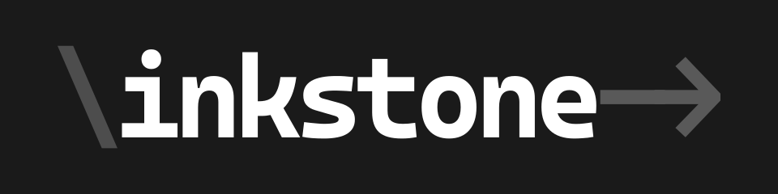

> _Inkstone is **not** a markup language._

Inkstone is an experimental general-purpose scripting language to make scripting less frustrating to work with. It was created as the author finds markup languages for game scripts being overwhelmed with unnecessary symbols, tags, or being too domain specific.

Inkstone is the course project for the Programming Language Principle class in BUAA.

## Related languages

Inkstone is inspired by [RenPy][]. Various aspects of Inkstone are inspired by [Ruby][], [Rust][], [Elixir][] and [Haskell][].

[renpy]: https://renpy.org/
[ruby]: https://www.ruby-lang.org/
[rust]: https://rust-lang.org/
[elixir]: https://elixir-lang.org/
[haskell]: https://haskell.org/

## Building

To build Inkstone, you'll need to install [Rust 1.57 stable or later](https://www.rust-lang.org/tools/install).

After installation, you only need to run:

```
cargo build
```

-- And you're good to go!

## Implementation status

| Status | feature                  |
| :----: | ------------------------ |
| Usable | Lexing                   |
| Usable | Parsing                  |
| Usable | Bytecode definition      |
| Usable | - Bytecode               |
|  WIP   | - Other data structures  |
|  WIP   | Bytecode generation      |
| Usable | - Symbol table           |
| Usable | - Constant table         |
|  WIP   | - Closure handling       |
|   No   | - Module system          |
|  WIP   | - Code generation        |
|  WIP   | Bytecode virtual machine |
|  WIP   | - Execution unit         |
|  WIP   | - Garbage collector      |
|   No   | Type checking            |
|   No   | JIT compiler             |
|  WIP   | Documentation            |

## Crates

- [`inkstone-syn`][syn] contains code and structures to parse and represent Inkstone source code.
- [`inkstone-bytecode`][bc] contains the definition of an instruction set for the Inkstone virtual machine.
- [`inkstone-codegen`][cg] contains code for generating bytecode from an AST.
- [`inkstone-vm`][vm] contains implementation of a virtual machine that can run bytecode.
- The root crate, `inkstone`, wraps the aforementioned crates and provides an executable.

[syn]: crates/inkstone-syn
[bc]: crates/inkstone-bytecode
[cg]: crates/inkstone-codegen
[vm]: crates/inkstone-vm

### Planned

- `inkstone-typings` for type-checking Inkstone code.
- `inkstone-jit` for JIT-ting efficient machine code from bytecode and probably type information, probably using `cranelift`.

## License

The source code of Inkstone's reference implementation is licensed under [Mozilla Public License 2.0][MPL]. 

[MPL]: https://www.mozilla.org/en-US/MPL/
